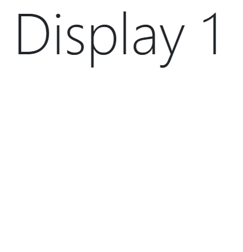
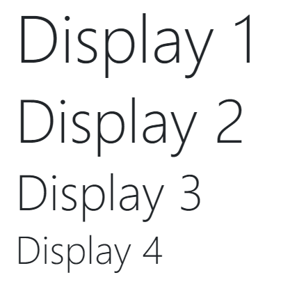
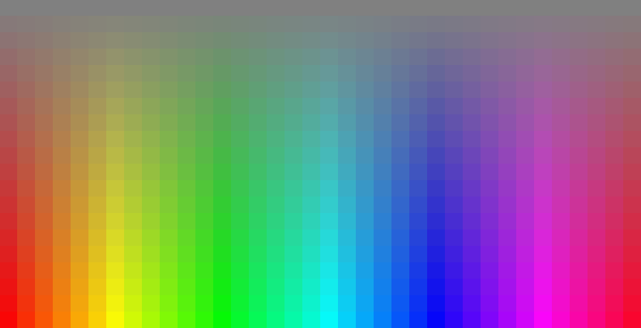

# PHP Exercises


## Welcome

This project was done for my PHP courses.
The goal is to discover the **PHP syntax** and specially the **loops**.


## 1 - Simple Loop Exercise

There is a file named **simpleLoop.php** generating the following html content.

### Current Display



### Source Code (html)

```php+HTML
<!DOCTYPE html>
<html lang="en">
  <head>
    <title>Simple Loop</title>
    <meta charset="UTF-8">
    <link rel="stylesheet" href="https://stackpath.bootstrapcdn.com/bootstrap/4.4.1/css/bootstrap.min.css" integrity="sha384-Vkoo8x4CGsO3+Hhxv8T/Q5PaXtkKtu6ug5TOeNV6gBiFeWPGFN9MuhOf23Q9Ifjh" crossorigin="anonymous">
  </head>
  <body>
    <div class="container">
      <div class="row">
        <h1 class="display-1">Display 1</h1>
      </div>
    </div>
  </body>
</html>
```


### <u>Goal</u>: Display



### <u>Goal</u>: Source Code

```php+HTML
<!DOCTYPE html>
<html lang="en">
  <head>
    <title>Simple Loop</title>
    <meta charset="UTF-8">
    <link rel="stylesheet" href="https://stackpath.bootstrapcdn.com/bootstrap/4.4.1/css/bootstrap.min.css" integrity="sha384-Vkoo8x4CGsO3+Hhxv8T/Q5PaXtkKtu6ug5TOeNV6gBiFeWPGFN9MuhOf23Q9Ifjh" crossorigin="anonymous">
  </head>
  <body>
    <div class="container">
     <div class="row">
        <h1 class="display-1">Display 1</h1>
      </div>
      <div class="row">
        <h1 class="display-2">Display 2</h1>
      </div>
      <div class="row">
        <h1 class="display-3">Display 3</h1>
      </div>
      <div class="row">
        <h1 class="display-4">Display 4</h1>
      </div>
    </div>
  </body>
</html>
```


### =============TODO===========

Modify **simpleLoop.php** to have this final html code using a php loop.


## 2 - Simple HSL Exercise

There is a file named **simpleHSL.php** generating the following html content.

### Current Display


### Source Code (html)

```php+HTML

<!DOCTYPE html>
<html lang="en">
  <head>
    <title>Simple HSL</title>
    <meta charset="UTF-8">
    <link rel="stylesheet" href="https://stackpath.bootstrapcdn.com/bootstrap/4.4.1/css/bootstrap.min.css" integrity="sha384-Vkoo8x4CGsO3+Hhxv8T/Q5PaXtkKtu6ug5TOeNV6gBiFeWPGFN9MuhOf23Q9Ifjh" crossorigin="anonymous">
  </head>
  <body>
    <div class="container-fluid">
      <div class="row">
      <table class="table">
        <tbody>
          <tr>
            <td style="border:0px; padding:0px; background-color:hsl(0, 50%, 50%);">&nbsp;</td>
            <td style="border:0px; padding:0px; background-color:hsl(10, 50%, 50%);">&nbsp;</td>
            <td style="border:0px; padding:0px; background-color:hsl(20, 50%, 50%);">&nbsp;</td>
            <td style="border:0px; padding:0px; background-color:hsl(30, 50%, 50%);">&nbsp;</td>
            <td style="border:0px; padding:0px; background-color:hsl(40, 50%, 50%);">&nbsp;</td>
            <td style="border:0px; padding:0px; background-color:hsl(50, 50%, 50%);">&nbsp;</td>
            <td style="border:0px; padding:0px; background-color:hsl(60, 50%, 50%);">&nbsp;</td>
            <td style="border:0px; padding:0px; background-color:hsl(70, 50%, 50%);">&nbsp;</td>
            <td style="border:0px; padding:0px; background-color:hsl(80, 50%, 50%);">&nbsp;</td>
            <td style="border:0px; padding:0px; background-color:hsl(90, 50%, 50%);">&nbsp;</td>
            <td style="border:0px; padding:0px; background-color:hsl(100, 50%, 50%);">&nbsp;</td>
            <td style="border:0px; padding:0px; background-color:hsl(110, 50%, 50%);">&nbsp;</td>
            <td style="border:0px; padding:0px; background-color:hsl(120, 50%, 50%);">&nbsp;</td>
            <td style="border:0px; padding:0px; background-color:hsl(130, 50%, 50%);">&nbsp;</td>
            <td style="border:0px; padding:0px; background-color:hsl(140, 50%, 50%);">&nbsp;</td>
            <td style="border:0px; padding:0px; background-color:hsl(150, 50%, 50%);">&nbsp;</td>
            <td style="border:0px; padding:0px; background-color:hsl(160, 50%, 50%);">&nbsp;</td>
            <td style="border:0px; padding:0px; background-color:hsl(170, 50%, 50%);">&nbsp;</td>
            <td style="border:0px; padding:0px; background-color:hsl(180, 50%, 50%);">&nbsp;</td>
            <td style="border:0px; padding:0px; background-color:hsl(190, 50%, 50%);">&nbsp;</td>
            <td style="border:0px; padding:0px; background-color:hsl(200, 50%, 50%);">&nbsp;</td>
            <td style="border:0px; padding:0px; background-color:hsl(210, 50%, 50%);">&nbsp;</td>
            <td style="border:0px; padding:0px; background-color:hsl(220, 50%, 50%);">&nbsp;</td>
            <td style="border:0px; padding:0px; background-color:hsl(230, 50%, 50%);">&nbsp;</td>
            <td style="border:0px; padding:0px; background-color:hsl(240, 50%, 50%);">&nbsp;</td>
            <td style="border:0px; padding:0px; background-color:hsl(250, 50%, 50%);">&nbsp;</td>
            <td style="border:0px; padding:0px; background-color:hsl(260, 50%, 50%);">&nbsp;</td>
            <td style="border:0px; padding:0px; background-color:hsl(270, 50%, 50%);">&nbsp;</td>
            <td style="border:0px; padding:0px; background-color:hsl(280, 50%, 50%);">&nbsp;</td>
            <td style="border:0px; padding:0px; background-color:hsl(290, 50%, 50%);">&nbsp;</td>
            <td style="border:0px; padding:0px; background-color:hsl(300, 50%, 50%);">&nbsp;</td>
            <td style="border:0px; padding:0px; background-color:hsl(310, 50%, 50%);">&nbsp;</td>
            <td style="border:0px; padding:0px; background-color:hsl(320, 50%, 50%);">&nbsp;</td>
            <td style="border:0px; padding:0px; background-color:hsl(330, 50%, 50%);">&nbsp;</td>
            <td style="border:0px; padding:0px; background-color:hsl(340, 50%, 50%);">&nbsp;</td>
            <td style="border:0px; padding:0px; background-color:hsl(350, 50%, 50%);">&nbsp;</td>
          </tr>
        </tbody>
      </div>
    </div>
  </body>
</html>
```


### <u>Goal</u>: Display




### =============TODO===========

Modify **simpleHSL.php** to have this final render using a php loop.
**TIPS**: To do that, you will modify the **saturation**...